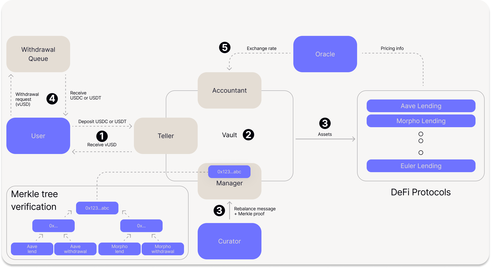

# Architecture & Flow of Funds

## **Overview**

Veda's BoringVault is built on a modular architecture with minimal core contract logic (\~100 lines of code, hence "boring"). Rather than embedding complex functionality into a single contract, the system delegates specific responsibilities to purpose-built external modules. This separation enhances security - each module can be audited, upgraded, and restricted independently while keeping the core vault contract simple and predictable.

<figure><figcaption></figcaption></figure>

The **BoringVault** is the central contract where all vault funds are custodied. It minimizes internal logic by delegating responsibilities to purpose-built external modules. The **Teller** handles deposits and withdrawals — minting shares on deposit at the exchange rate provided by the **Accountant**, enforcing share lock periods to protect against MEV, and burning shares on withdrawal. The Accountant publishes the vault's exchange rate with onchain safety checks that limit update frequency and constrain rate movements.

Strategy execution is governed by the **Manager**, which stores all permitted operations in a Merkle tree and verifies each rebalance action against it, ensuring only pre-authorized protocol interactions can occur. The **DecoderAndSanitizer** provides an additional layer of validation by decoding and checking calldata for every external call the vault makes. An optional **Hook** module can enforce custom logic before share transfers, enabling compliance features like address whitelisting or transfer restrictions.

For withdrawals, the **BoringQueue** implements a time-delayed, solver-based process: users submit a withdrawal request, and after a configurable maturity period, third-party solvers fulfill it by delivering the underlying assets. The BoringQueue serves as the standard withdrawal method and as a fallback when instant withdrawal buffers have insufficient liquidity.

## Flow of Funds

The following describes the lifecycle of assets through a Veda vault — from deposit through strategy deployment to withdrawal. At every stage, funds remain onchain: held in the BoringVault contract, deployed into DeFi protocol positions managed by the vault, or in transit through the withdrawal process.

1. **Deposit** — The user deposits assets (e.g., USDC or USDT) through the Teller and receives vault share tokens (e.g., vUSD) in return. The Teller retrieves the current exchange rate from the Accountant to determine how many shares to mint.
2. **Vault custody** — Deposited assets are held in the BoringVault contract awaiting strategy deployment.
3. **Strategy deployment** — The Curator submits a rebalance message with a Merkle proof to the Manager. The Manager verifies the operation against the Merkle tree whitelist — which encodes every permitted target contract, function call, and parameter — and, if valid, deploys the vault's assets into approved DeFi protocols such as Aave, Morpho, Euler, and others.
4. **Withdrawal** — When a user wants to exit, they submit a withdrawal request to the Withdrawal Queue, sending their vault shares and receiving the underlying assets in return. Separating the withdrawal logic from the core vault contract provides additional security isolation — the BoringVault itself never needs to implement complex exit logic.
5. **Exchange rate updates** — The Oracle provides pricing information to the Accountant, which calculates and updates the vault's exchange rate to reflect earned yield. Onchain safety checks limit update frequency and constrain how much the rate can change between updates.
